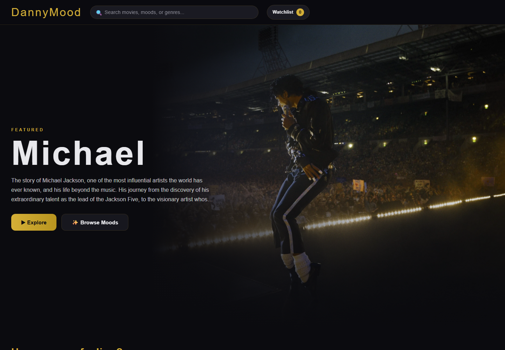

# DannyMood

DannyMood is a responsive Flask movie discovery app powered by the TMDB API.
It recommends movies from one mood or a blend of moods and presents them in a
dark, streaming-inspired interface.

## Screenshot



## Features

- Trending, popular, top-rated, and Indian movie collections
- Multi-select mood recommendations with multi-genre TMDB discovery
- Happy mood using Comedy, Animation, and Adventure
- Recommendation explanations based on selected moods and matching genres
- Paginated API routes with append-only Load More controls
- Five-minute `SimpleCache` response caching
- Debounced movie search
- Persistent browser watchlist using `localStorage`
- Detailed movie modal with runtime, tagline, genres, release date, and rating
- Top-five cast display with character names and profile images
- More Like This recommendations
- YouTube trailers and regional TMDB watch-provider availability
- Demo data fallback when TMDB is unavailable
- Mobile-responsive cards, navigation, watchlist, and modal content

## Tech Stack

- Python and Flask
- Flask-Caching with `SimpleCache`
- TMDB API
- JavaScript, HTML, and CSS
- Browser `localStorage`

## Installation

1. Clone the repository and enter the project directory.

2. Create and activate a virtual environment:

   ```powershell
   python -m venv .venv
   .\.venv\Scripts\Activate.ps1
   ```

3. Install dependencies:

   ```powershell
   pip install -r requirements.txt
   ```

4. Copy `.env.example` to `.env` and add a TMDB API key:

   ```dotenv
   TMDB_API_KEY=your_tmdb_api_key_here
   ```

   API keys are available from
   [TMDB account settings](https://www.themoviedb.org/settings/api).

5. Start the app:

   ```powershell
   python app.py
   ```

6. Open `http://localhost:5000`.

## API Endpoints

Collection endpoints accept `page`, and search/mood endpoints preserve their
filters while paging.

| Endpoint | Description |
| --- | --- |
| `GET /api/trending?page=1` | Weekly trending movies |
| `GET /api/popular?page=1` | Popular movies |
| `GET /api/top-rated?page=1` | Top-rated movies |
| `GET /api/indian?page=1` | Popular Hindi-language movies |
| `GET /api/search?q=arrival&page=1` | Movie search |
| `GET /api/mood?mood=Happy&mood=Thriller&page=1` | Blended mood recommendations |
| `GET /api/movie/<id>` | Full movie details |
| `GET /api/movie/<id>/credits` | Top-five cast members |
| `GET /api/movie/<id>/similar?page=1` | Similar movies |
| `GET /api/movie/<id>/trailer` | YouTube trailer key |
| `GET /api/movie/<id>/watch-providers?region=IN` | Regional watch providers |

## Project Structure

```text
DannyMood/
|-- app.py
|-- requirements.txt
|-- templates/
|   `-- index.html
`-- static/
    |-- css/style.css
    |-- js/main.js
    `-- screenshots/home.png
```

## Future Roadmap

- User accounts with cloud-synced watchlists
- Advanced language, year, provider, and rating filters
- Personalized recommendations based on watchlist history
- Automated backend and browser test suites
- Production cache support with Redis
- Accessibility audit and keyboard-first card navigation

## Attribution

Movie metadata and images are provided by
[The Movie Database (TMDB)](https://www.themoviedb.org/). This product uses
the TMDB API but is not endorsed or certified by TMDB.
